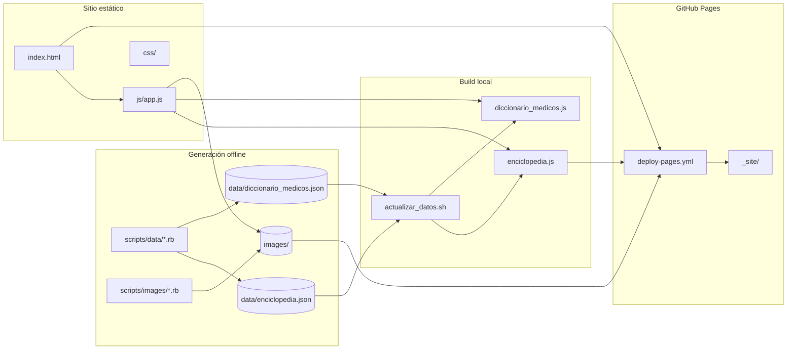

# Arquitectura

Visión general del flujo de datos y del frontend de Enciclopedia Animal.

## Diagrama de flujo

## Capas

### 1. Datos (JSON)

- **`data/enciclopedia.json`**: fuente de verdad — animales, razas, enfermedades, nutrición.
- **`data/diccionario_medicos.json`**: términos médicos por categoría.

Los scripts en `scripts/data/` leen y escriben estos JSON. El archivo principal de entrada/salida es `enciclopedia.json`.

### 2. Build JS (runtime del navegador)

El navegador no carga JSON directamente; usa variables globales:

- `data/enciclopedia.js` → `window.ENCICLOPEDIA_DATA`
- `data/diccionario_medicos.js` → `window.DICCIONARIO_MEDICOS`

`actualizar_datos.sh` ejecuta `build_medical_dictionary.rb` y convierte JSON → JS.

### 3. Frontend (`js/app.js`)

SPA ligera sin framework:

- **Vistas**: bienvenida, explorar razas, detalle de raza, enfermedades, diccionario.
- **Estado**: filtros por animal/tamaño, búsqueda, navegación por hash o botones.
- **Datos**: lee `ENCICLOPEDIA_DATA` y `DICCIONARIO_MEDICOS` al cargar.
- **Imágenes**: rutas relativas `images/{raza_id}.jpg|svg` y `images/enfermedades/`.

### 4. Imágenes

- Descarga automatizada: `scripts/images/` (Google, Wikipedia, Wikimedia).
- Placeholders SVG: `scripts/setup/generate_placeholders.sh`.
- Overrides puntuales: `apply_image_overrides.rb`.

### 5. Despliegue

GitHub Actions copia `index.html`, `css/`, `js/`, `data/`, `images/` a `_site/` y publica en Pages. No hay bundler ni Jekyll en producción (`.nojekyll` en raíz).

## Scripts clave

| Acción | Comando |
|--------|---------|
| Regenerar diccionario + JS | `bash actualizar_datos.sh` |
| Pipeline completo de datos | `ruby scripts/data/update_enciclopedia_full.rb` |
| Servidor local | `bash iniciar.sh` |
| Pruebas | `bash ejecutar_pruebas.sh` |

## Decisiones de diseño

- **Estático puro**: compatible con GitHub Pages gratis, sin backend.
- **JSON como fuente**: editable y versionable; JS es artefacto derivado.
- **Ruby para ETL**: scripts de datos e imágenes en Ruby por consistencia con las pruebas.
- **Raíz plana para assets**: `index.html`, `css/`, `js/`, `data/`, `images/` en raíz para simplificar Pages y URLs.
