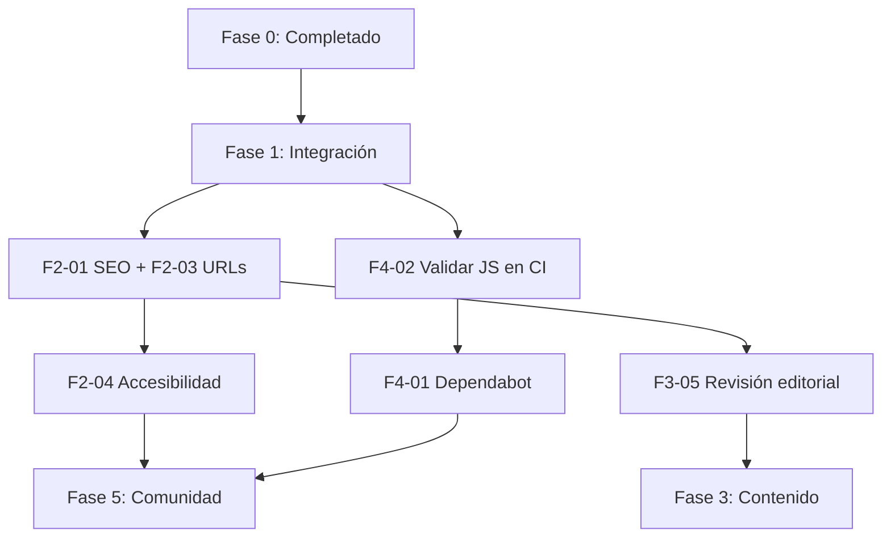

# Trazado de ruta — Enciclopedia Animal

> **Última actualización:** 12 de julio de 2026  
> **Sitio en producción:** https://ramiro-andres.github.io/enciclopediaanimal/  
> **Repositorio:** [ramiro-andres/enciclopediaanimal](https://github.com/ramiro-andres/enciclopediaanimal)

Este documento define el plan de trabajo por fases para el atlas veterinario estático. Cada tarea incluye identificador, prioridad, responsable sugerido, criterio de éxito y dependencias.

---

## Resumen ejecutivo

| Fase | Nombre | Estado | Tareas |
|------|--------|--------|--------|
| 0 | Completado | ✅ Hecho | 12 ítems |
| 1 | Integración inmediata | 🟡 En curso | 4 tareas |
| 2 | Calidad y UX | ⬜ Pendiente | 8 tareas |
| 3 | Contenido | ⬜ Pendiente | 7 tareas |
| 4 | DevOps | ⬜ Pendiente | 6 tareas |
| 5 | Comunidad | ⬜ Pendiente | 5 tareas |

**Estado de PRs (12 jul 2026):** todos los PRs relevantes están **mergeados** (#1–#7). No hay PRs abiertos. El último despliegue (`main`, PR #7) completó con éxito los workflows `test` y `Desplegar en GitHub Pages`.

---

## Fase 0: Completado

Infraestructura, contenido base y mejoras recientes ya entregadas.

| ID | Descripción | Prioridad | Responsable | Criterio de éxito | Dependencias |
|----|-------------|-----------|-------------|-------------------|--------------|
| F0-01 | Enciclopedia con **355 razas** en 13 categorías animales | — | `@ramiro-andres` | `test_cantidad_minima_de_razas` pasa; datos en `data/enciclopedia.json` | — |
| F0-02 | **2 099 entradas** de enfermedades vinculadas a razas | — | `@ramiro-andres` | Cada raza tiene ≥5 enfermedades con campos clínicos | F0-01 |
| F0-03 | Diccionario médico con **527 términos** en 15 categorías | — | `@ramiro-andres` | `data/diccionario_medicos.json` + JS derivado | — |
| F0-04 | UI editorial (SPA en `js/app.js`, estilos en `css/`) | — | `@ramiro-andres` | Navegación razas, enfermedades, glosario funcional | F0-01, F0-03 |
| F0-05 | Imágenes de razas (0 faltantes según `list_missing_images.rb`) | — | `@ramiro-andres` | Todas las razas tienen `.jpg` >8 KB o SVG | F0-01 |
| F0-06 | Imágenes de enfermedades en `images/enfermedades/` | — | `@ramiro-andres` | Rutas `images/enfermedades/*.jpg` en JSON | F0-02 |
| F0-07 | Razas de Colombia (batch 6) | — | `@ramiro-andres` | Razas colombianas presentes en dataset | F0-01 |
| F0-08 | Reorganización del repo y documentación (`docs/`) | — | `@ramiro-andres` | PR #3 mergeado | — |
| F0-09 | Limpieza: sin servidor local (`iniciar.sh` eliminado) | — | `@ramiro-andres` | PR #4 mergeado; flujo estático documentado | F0-08 |
| F0-10 | Responsividad móvil | — | `@ramiro-andres` | PR #5 mergeado; usable en viewport ≤768px | F0-04 |
| F0-11 | Modal de aviso educativo veterinario | — | `@ramiro-andres` | PRs #6 y #7 mergeados | F0-04 |
| F0-12 | CI/CD: GitHub Pages + protección de `main` | — | `@ramiro-andres` | Workflows `test` y `deploy-pages` verdes en `main` | F0-08 |

---

## Fase 1: Integración inmediata

Consolidar el estado post-merge y asegurar que producción refleja `main`.

| ID | Descripción | Prioridad | Responsable | Criterio de éxito | Dependencias |
|----|-------------|-----------|-------------|-------------------|--------------|
| F1-01 | Verificar despliegue en producción tras PR #7 | **Alta** | `@ramiro-andres` | Sitio carga; modal de disclaimer aparece en cada visita; sin errores en consola | F0-11, F0-12 |
| F1-02 | Sincronizar clones locales con `origin/main` | **Alta** | `@ramiro-andres` | `git pull` en `main`; ramas locales obsoletas identificadas | — |
| F1-03 | Limpiar ramas remotas/locales ya mergeadas | Media | `@ramiro-andres` | Eliminar `feature/disclaimer-modal`, `fix/mobile-responsive`, `fix/disclaimer-always-show`, `chore/*` tras confirmar merge | F1-02 |
| F1-04 | Ejecutar suite de pruebas en `main` actualizado | **Alta** | `@ramiro-andres` | `bash ejecutar_pruebas.sh` exitoso; CI `test` verde | F1-02 |

---

## Fase 2: Calidad y UX

Pulir experiencia de usuario, descubribilidad y accesibilidad sin cambiar la arquitectura estática.

| ID | Descripción | Prioridad | Responsable | Criterio de éxito | Dependencias |
|----|-------------|-----------|-------------|-------------------|--------------|
| F2-01 | Meta tags SEO (`description`, Open Graph, Twitter Card) | **Alta** | `@ramiro-andres` | `index.html` incluye meta por defecto; preview correcto al compartir URL | F1-01 |
| F2-02 | Títulos dinámicos por vista (raza, enfermedad, glosario) | Media | `@ramiro-andres` | `document.title` refleja contenido activo | F2-01 |
| F2-03 | URLs compartibles con hash (`#raza/id`, `#enfermedad/id`) | **Alta** | `@ramiro-andres` | Recargar con hash restaura la vista; enlace copiable funciona | F0-04 |
| F2-04 | Auditoría de accesibilidad (WCAG 2.1 AA básico) | Media | `@ramiro-andres` | Navegación por teclado completa; contraste ≥4.5:1; foco visible; axe/Lighthouse sin errores críticos | F0-10 |
| F2-05 | Pulido móvil: touch targets, sidebar, modal disclaimer | Media | `@ramiro-andres` | Lighthouse mobile ≥90 en Performance y Accessibility | F0-10, F0-11 |
| F2-06 | Evaluación PWA (manifest + service worker offline) | Baja | `@ramiro-andres` | Decisión documentada: implementar o posponer; si sí, Lighthouse PWA instalable | F2-01 |
| F2-07 | Favicon y assets de marca (`apple-touch-icon`) | Media | `@ramiro-andres` | Iconos en raíz referenciados desde `index.html` | — |
| F2-08 | Modo de lectura / preferencia `prefers-reduced-motion` | Baja | `@ramiro-andres` | Animaciones 3D desactivadas cuando el usuario lo solicita | F0-04 |

---

## Fase 3: Contenido

Expandir y mantener la base de conocimiento veterinario.

| ID | Descripción | Prioridad | Responsable | Criterio de éxito | Dependencias |
|----|-------------|-----------|-------------|-------------------|--------------|
| F3-01 | Ampliar razas (objetivo: +50 razas) | Media | `@ramiro-andres` | Nuevas entradas en `scripts/data/` + JSON regenerado; pruebas pasan | F1-04 |
| F3-02 | Completar imágenes de enfermedades faltantes o placeholder | Media | `@ramiro-andres` | Script `download_disease_google_images.rb` ejecutado; sin rutas rotas | F0-06 |
| F3-03 | Expandir diccionario médico (+100 términos) | Media | `@ramiro-andres` | `total_terminos` ≥627; categorías balanceadas | F0-03 |
| F3-04 | Enriquecer perfiles clínicos (nutrición, protocolos) | Baja | `@ramiro-andres` | Scripts `breed_clinical_profiles.rb`, `pharma_protocols.rb` aplicados | F3-01 |
| F3-05 | Revisión editorial de disclaimer y fuentes bibliográficas | **Alta** | `@ramiro-andres` | Texto legal revisado; `fuentes_bibliograficas` no vacías en muestra aleatoria | F0-11 |
| F3-06 | Contenido regional LATAM (México, Argentina, Chile) | Baja | Colaborador / `@ramiro-andres` | ≥10 razas nuevas por país documentadas | F3-01 |
| F3-07 | Validar coherencia de datos con pipeline completo | Media | `@ramiro-andres` | `ruby scripts/data/update_enciclopedia_full.rb` + `actualizar_datos.sh` sin errores | F3-01 |

---

## Fase 4: DevOps

Fortalecer CI/CD, mantenimiento y observabilidad del despliegue.

| ID | Descripción | Prioridad | Responsable | Criterio de éxito | Dependencias |
|----|-------------|-----------|-------------|-------------------|--------------|
| F4-01 | Dependabot para GitHub Actions | Media | `@ramiro-andres` | `.github/dependabot.yml` activo; PRs de bump revisados | — |
| F4-02 | Validar `data/*.js` en CI antes del deploy | **Alta** | `@ramiro-andres` | Workflow falla si JSON cambió sin regenerar JS (`actualizar_datos.sh`) | F1-04 |
| F4-03 | Job de verificación de imágenes en CI | Media | `@ramiro-andres` | `list_missing_images.rb` corre en PR; falla si hay faltantes | F0-05 |
| F4-04 | Cache de artefactos / optimización de deploy | Baja | `@ramiro-andres` | Tiempo de workflow deploy ≤25 s; tamaño `_site` documentado | F0-12 |
| F4-05 | Badge de CI y deploy en README | Baja | `@ramiro-andres` | Badges de status visibles en README principal | F0-12 |
| F4-06 | Alertas de fallo de deploy (GitHub notifications) | Baja | `@ramiro-andres` | Mantenedor recibe notificación si `deploy-pages` falla | F0-12 |

---

## Fase 5: Comunidad

Preparar el proyecto para contribuciones externas seguras y escalables.

| ID | Descripción | Prioridad | Responsable | Criterio de éxito | Dependencias |
|----|-------------|-----------|-------------|-------------------|--------------|
| F5-01 | Plantillas de issues (bug, contenido, feature) | **Alta** | `@ramiro-andres` | `.github/ISSUE_TEMPLATE/` con ≥3 plantillas | F0-08 |
| F5-02 | Plantilla de PR ampliada con checklist de contenido | Media | `@ramiro-andres` | PR template incluye verificación de datos, imágenes y disclaimer | F0-08 |
| F5-03 | Guía de contribución de contenido (razas/enfermedades) | Media | `@ramiro-andres` | Sección en `docs/CONTRIBUIR.md` con formato JSON esperado | F3-01 |
| F5-04 | Etiquetas de GitHub (`content`, `bug`, `good first issue`) | Media | `@ramiro-andres` | Labels creados y documentados | F5-01 |
| F5-05 | Política de revisión y CODEOWNERS por área | Baja | `@ramiro-andres` | CODEOWNERS cubre `data/`, `js/`, `scripts/` si hay más mantenedores | F0-12 |

---

## Orden sugerido de ejecución

### Sprint inmediato (próximos 7 días)

1. **F1-01** — Verificar producción post-PR #7  
2. **F1-04** — Pruebas en `main`  
3. **F2-01** — Meta tags SEO  
4. **F2-03** — URLs con hash compartibles  
5. **F4-02** — CI valida JS derivado  

### Sprint corto (2–4 semanas)

6. **F1-03** — Limpieza de ramas  
7. **F2-04** — Accesibilidad  
8. **F3-05** — Revisión editorial  
9. **F5-01** — Plantillas de issues  
10. **F4-01** — Dependabot  

---

## Métricas de referencia

| Métrica | Valor actual | Objetivo Fase 3 |
|---------|--------------|-----------------|
| Razas | 355 | 400+ |
| Entradas de enfermedades | 2 099 | 2 300+ |
| Términos diccionario | 527 | 627+ |
| Imágenes de razas faltantes | 0 | 0 |
| PRs abiertos | 0 | — |
| Workflows CI | 2 (`test`, `deploy-pages`) | 2–3 |

---

## Convenciones de este documento

- **Prioridad Alta:** bloquea calidad en producción o integridad de datos.  
- **Prioridad Media:** mejora notable de UX o mantenibilidad.  
- **Prioridad Baja:** nice-to-have; ejecutar cuando las fases anteriores estén estables.  
- **Responsable:** `@ramiro-andres` es mantenedor principal; tareas de contenido pueden delegarse a colaboradores vía issues etiquetados `good first issue`.

---

## Historial de cambios

| Fecha | Cambio |
|-------|--------|
| 2026-07-12 | Creación inicial del trazado de ruta (post-merge PR #7) |
